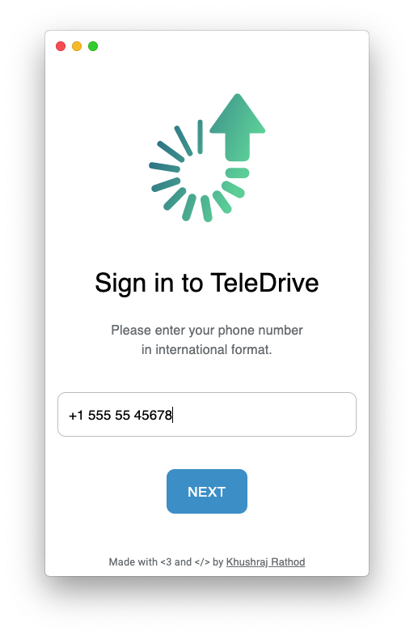
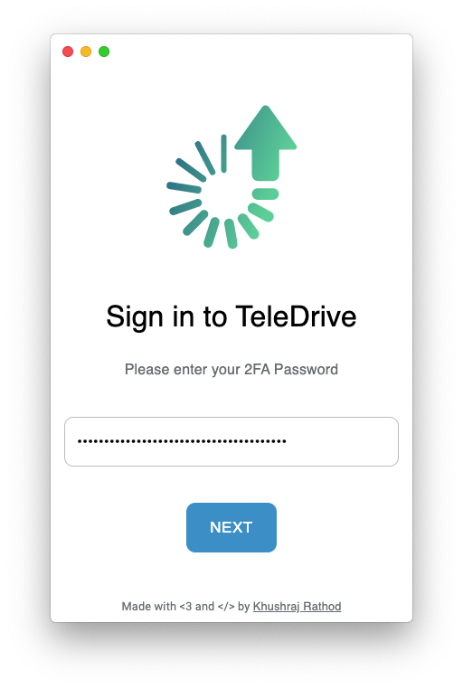

# Signing in

Since TeleDrive uses Telegram's saved messages as storage, you can sign in to TeleDrive using Telegram
::: warning  
TeleDrive doesn't implement signing up for telegram yet. If you don't already have a telegram account, [sign up for telegram](https://telegram.org) first.
:::  

- Steps
  - Launch TeleDrive
  - Enter your phone number
  - Enter the one time password received via the Telegram app or via SMS
  - If you have two-factor authentication enabled, enter your password
  
## Phone number
Your phone number must be in the international format (+ and country code). Eg.

> +1 555 555 1234
>
> +91 98123 45678

## One time password (OTP)
Your OTP will arrive either via SMS or via Telegram

 

## Two-factor authentication password
If you haven't set a Two-factor authentication password, or you don't know what that is, you can skip this section.

