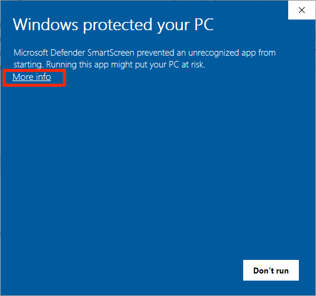
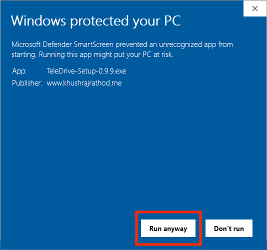

# Windows
## Microsoft Store (recommended for most users)
AppX is still a work in progress

## Executable installer (NSIS)

- Go to the [homepage](https://teledrive.khushrajrathod.me)
- Select 'Download for Windows' (Or select the dropdown > Windows (Executable Installer))

- Run the installer by double-clicking it

::: warning  
You might see a warning from Windows SmartScreen  
:::

- Click 'More info'

- Click 'Run anyway'
